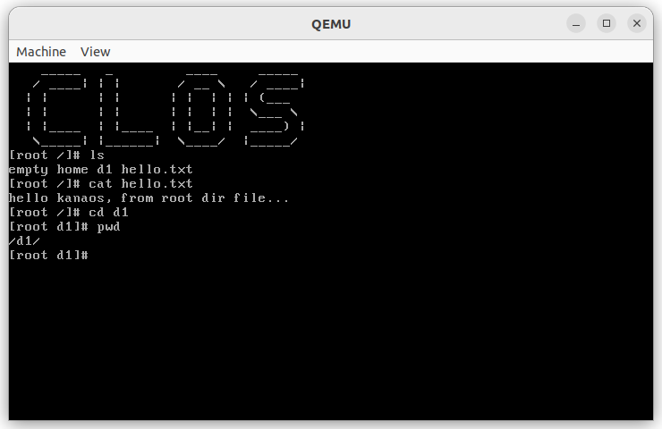

## kanos
* about<br>
一个32位单核的简易OS，类old version Linux，OS学习实践
* dependence<br>
  开发环境使用的是ubuntu 22.10，这里建议使用archlinux，archlinux包比较新装依赖会顺利一些。ubuntu用apt安装的bochs可能会有问题需要自己编译
  >gcc v12<br>
  >nasm v2.15.05<br>
  >bochs v2.7<br>
  >qemu v7.0<br>
  >python3<br>
* build<br>
  * 可以单独构建硬盘，也可以直接在bochs或qemu启动
  ```makefile
  make image
  make bochs
  make qemu
  ```
  * 也可以用调试模式启动，配合gdb进行调试。bochs调试需要在编译安装时添加对应参数，并且该参数与部分参数有冲突，因此要编译安装两份bochs，所以推荐qemu调试
  ```makefile
  make bochsg
  make qemug
  ```
* feature<br>
  * 中断：时钟，定时器，键盘等中断
  * 内存管理：经典Linux内存布局，虚拟地址映射
  * 用户模式：特权级隔离内核和用户
  * 多线程：中断驱动的多任务交替
  * 文件系统：参考minix的文件系统
  * 系统调用：实现了基本的几个系统调用
* running<br>

* reference<br>
  * ***《操作系统真象还原》谢刚***（主要参考书籍，强力推荐）
  * b站up主 *"踌躇月光"* 的OS系列视频教程（该up也是参考了上面提到的书，并且章节分明，非常好的教程）
  * b站up主 *"Lunaixsky"* 的OS系列视频教程（用的都是比较新的硬件特性，比较接近现代OS）